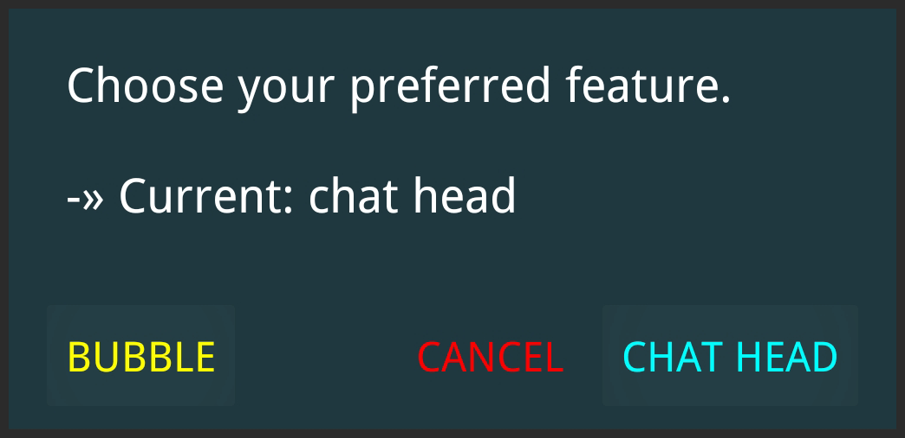

ChatHeadEnabler
===============
An Xposed module that lets you choose between chat head and bubble in Facebook Messenger

<picture></picture>

[](https://github.com/NeonOrbit/ChatHeadEnabler/releases/latest)
[](https://raw.githubusercontent.com/NeonOrbit/Files/dl-stats/ChatHeadEnabler.json)
[](https://forum.xda-developers.com/t/4305391)

Requirements
------------
- Android 11+
- Root: [Magisk](https://github.com/topjohnwu/Magisk)
- Xposed: [LSPosed](https://github.com/LSPosed/LSPosed)

For non-rooted device: check this [thread](https://forum.xda-developers.com/t/4331215)

Installation
------------
- Download and Install ChatHeadEnabler.
- Active it from LSPosed Manager.
- Restart Messenger.

Features
--------
By default, this module enables the chat head feature.  
In order to change it to bubble,
- Open messenger app and go to its setting page.
- Click on the toggle <picture></picture> icon from the top-right corner.
- Choose bubble option from the pop-up dialog.

If you want to hide the toggle icon, long press on it and remove.

Support
-------
Help: [XDA-Thread](https://forum.xda-developers.com/t/4305391)

[](https://www.paypal.me/N3onOrbit/)  
Crypto: [Bitcoin](https://blockchair.com/bitcoin/address/bc1qha53u7h4wed5h4z5mt9t4shfgf66vsy79v55qn)
| [BitcoinCash](https://blockchair.com/bitcoin-cash/address/qpyk0wzc2syqg39msnjyg44z4qz9h34upyws7edefm)
| [Ethereum](https://etherscan.io/address/0xe92961cc77c3195b8d493fF77aa7425FB9B253D8)

------------
Certificate Fingerprints:
```
SHA-1: FE20183C7D2F5C5D9FE1BCE6B7AB31A35FF4C8D0
SHA-256: 91870331A45A1C1E8F34BB27D6973CD72FD8AD98CBF4B306276BFEC06D61EBE8
```
